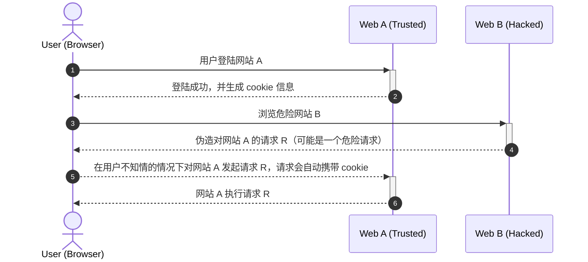
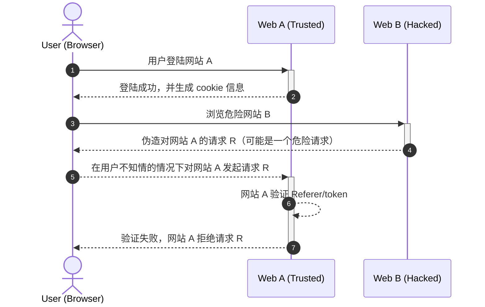

## 什么是 CSRF 攻击

CSRF（Cross-Site Request Forgery）的全称是`跨站请求伪造`，也被称为 `One Click Attack` 或者 `Session Riding`，通常缩写为 CSRF 或者 XSRF。
CSRF 的中文名称尽管听起来像跨站脚本攻击（XSS），但它与XSS非常不同，并且攻击方式几乎相左。
XSS 利用站点内的信任用户，而 CSRF 则通过伪装来自受信任用户的请求来攻击受信任的网站。
与 XSS 攻击相比，CSRF 攻击往往不大流行（因此对其进行防范的资源也相当稀少）和难以防范，所以被认为比 XSS 更具危险性。

我们可以这么理解 CSRF 攻击：攻击者借助浏览器自动封装 cookie 来伪造请求，以你的名义进行某些非法操作。
CSRF 能够使用你的账户发送邮件，获取你的敏感信息，甚至盗走你的账户购买商品等。
CSRF 攻击其实是利用了 web 中用户身份认证验证的一个漏洞：
简单的身份验证仅仅能保证请求发自某个用户的浏览器，却不能保证请求本身是用户自愿发出的。

想要达成 CSRF 攻击，需要两个条件：

1. 用户先登陆受信任的站点 A，并产生 cookie 信息
2. 在 cookie 未失效的情况下，访问危险网站 B

## CSRF 攻击流程

<!--more-->

## 预防 CSRF 攻击

### 验证 `Referer` 请求头

按照 HTTP 协议，在 HTTP 请求头中有一个 `Referer` 的请求头，它用来记载发起 HTTP 请求的地址。
我们可以通过 `Referer` 中的域名信息来判断请求是否来自我们自己的网站，
如果请求来自其他网站，那么极有可能是黑客的 CSRF 攻击。

这种方法的好处便是简单易行，只要开发人员在请求入口处进行统一判断就行。

然而，这种方法也并非万无一失。
`Referer` 请求头由浏览器提供，虽然 HTTP 协议有明确要求，但是每个浏览器对 `Referer` 的具体实现也可能有差别，并不能保证浏览器本身没有问题。
另外，将 `Referer` 寄托于第三方浏览器本身也是一种不安全的行为。

通过 `Referer` 可以追踪到用户的浏览行为，而有些用户为了防止隐私泄漏，设置禁止请求携带 `Referer` 请求头。
这样的话，服务器因为无法获取 `Referer`，从而拒绝服务。

最新版的浏览器无法篡改 `Referer`，但是一些旧版本的浏览器可能会被黑客篡改 `Referer`，从而达成 CSRF 攻击。

### 请求中携带 token 并验证

token 是一种类似 sessionid 的东西，由于浏览器请求会自动携带 cookie，所以 token 不能放在 cookie 中。
一般情况下可以将 token 放在请求参数中，服务器在接受到请求时，会同时判断 token 的有效性。

如果只是为了防止 CSRF 攻击，token 也没必要每次都不一样，我们可以在用户登陆的时候与 sessionid 同时生成并返回给用户。

### 在请求头中携带自定义属性

与请求参数中携带 token 类似，这里是将 token 放置在请求头中。

### 防止 CSRF 攻击流程如下

