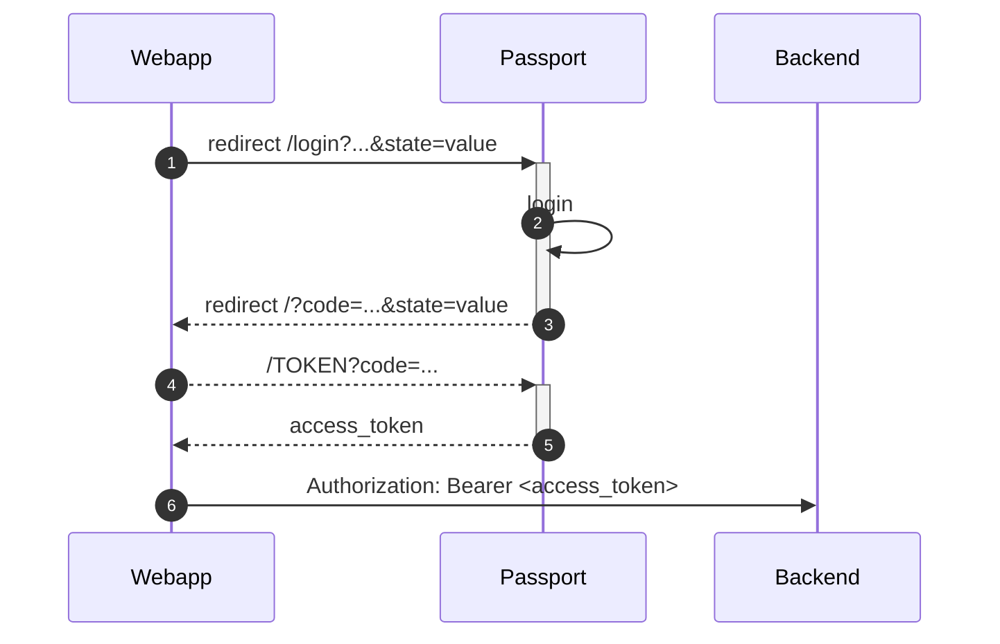
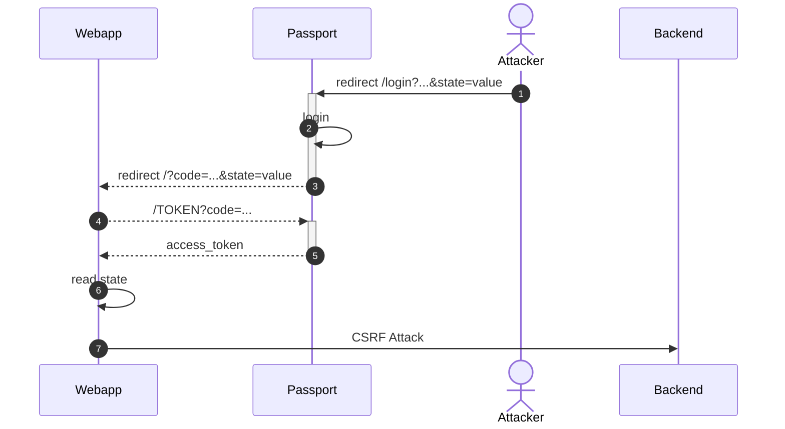
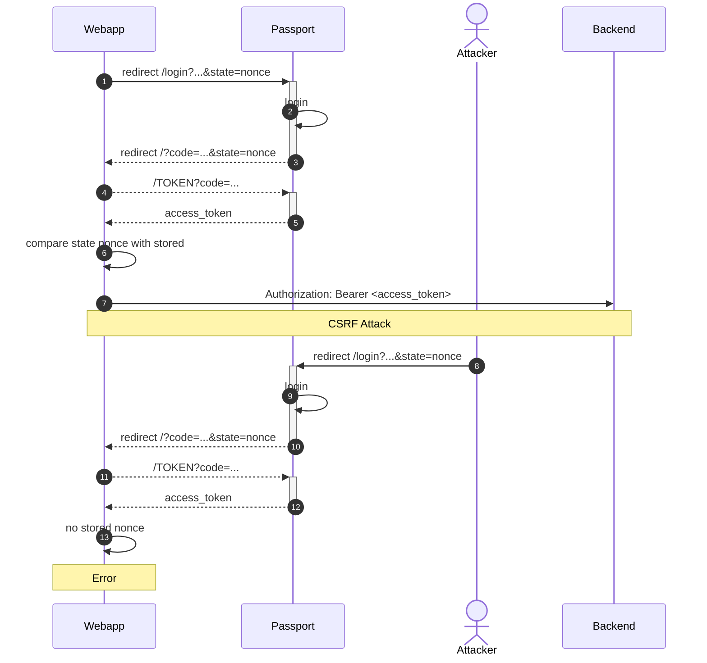

我们在开发微服务的时候，多半会采用 OAuth2 进行授权认证。
本文将介绍如何通过状态随机数来防止可能的 CSRF 攻击。

## CSRF



## OAuth2 中的 CSRF 攻击

OAuth2 授权过程中有以下几个参数：

* `response_type=code`
* `client_id`
* `redirect_uri`

这几个参数都是公开的，所有用户都使用相同的值。
攻击者也无法控制 `redirect_uri`，因为这个会配置在授权服务器的合法地址列表中。

攻击者能控制的是可选参数 `state`，如果授权过程中提供了 `state`，那么授权成功后会原封不动的返回 `state`。
授权流程如下：

`state` 本身不容易受到任何攻击，但是 Web 应用程序可能会实现自定义逻辑，这种逻辑使用攻击者有机可乘。
攻击流程如下：

<!--more-->

## 防御

要防止这种攻击也非常简单，将 `state` 换成随机数，应用程序在本地妥善保存这个随机数与业务之间的关系。
在授权结束后，通过随机数判断要执行的业务，并在同时将随机数与业务对应的关系删除。
而在每次请求时都使用新的随机数，这样便能防止攻击者猜测到真正要执行的业务。

