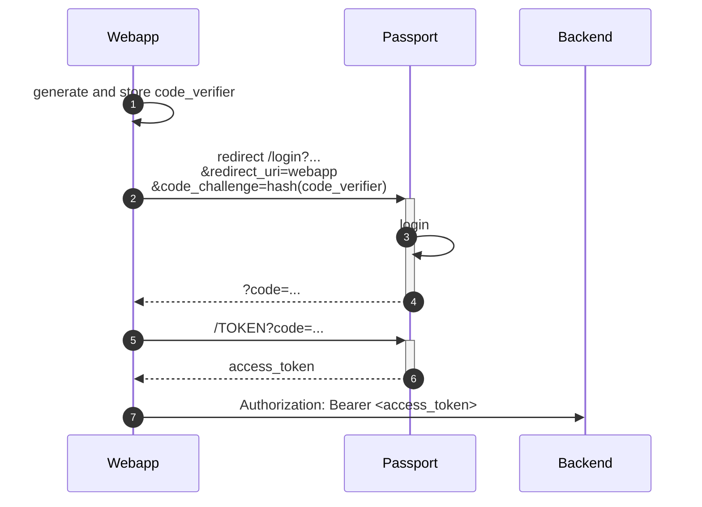
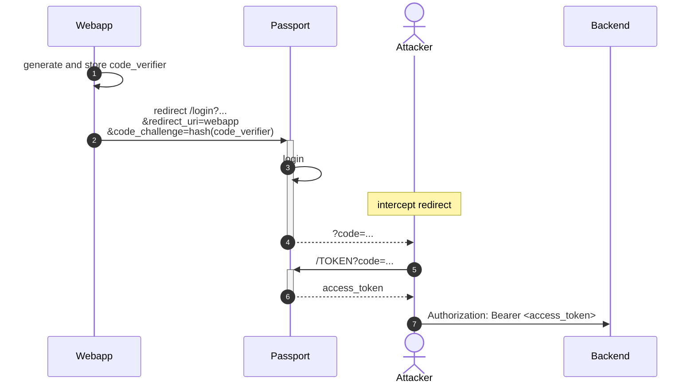
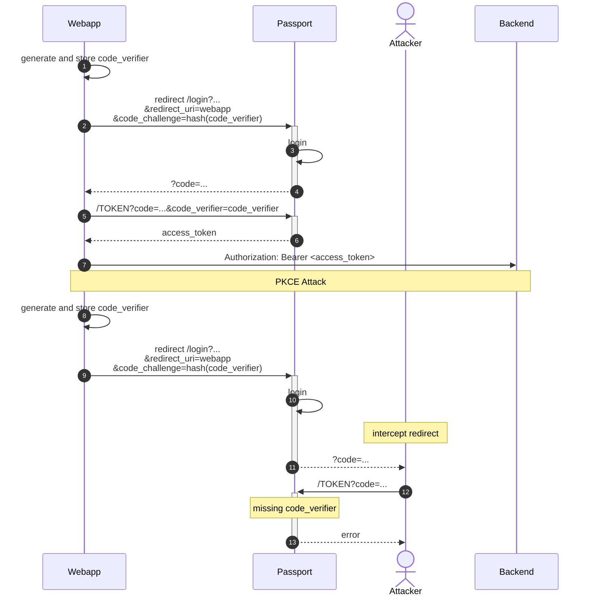

## PKCE

PKCE，发音为 `pixy`，是 Proof Key for Code Exchange 的首字母缩写。
PKCE 流程和标准授权代码流程之间的主要区别是用户不需要提供 client_secret。
PKCE 降低了**本地应用程序**（Native Application， OAuth客户端的一种）的安全风险，
因为源代码中不需要嵌入 `secret`，这限制了通过逆向工程的获取 `secret` 的可能性。

为了代替 `client_secret`，客户端应用程序创建了一个唯一的字符串值 `code_verifier`，并其进行哈希处理生成 `code_challenge`。
当客户端应用程序启动授权码流程的第一部分时，它会发送一个 `code_challenge`。

一旦用户通过身份验证并将授权码返回给客户端应用程序，它就会用授权码请求换取一个 `access_token`。

在此步骤中，客户端应用程序必须在 `code_verifier` 参数中包含原始唯一字符串值。
如果成功匹配，则身份验证完成并返回 `access_token`。

其工作流程如下：

## 攻击

攻击者无法篡改流程中的任何信息，但是在很多情况下，请求可能会被截获。
在移动应用程序中，攻击者可以为指定的 URL 注册专门的处理程序，
或者通过后端程序将请求日志记录到一个不安全的地方。
这两种方式，攻击者都能拿到授权码，进而获取到有效的授权令牌。

<!--more-->

## 防御

防止这种的攻击的办法也比较简单，可以在请求 token 的时候，加上参数 `code_verifier`，
授权服务器对 `code_verifier` 进行 hash 检验。

